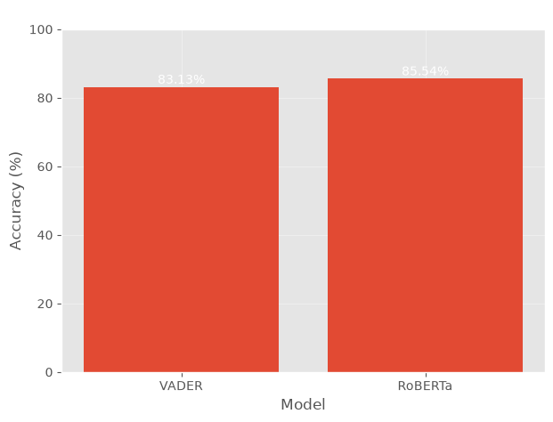
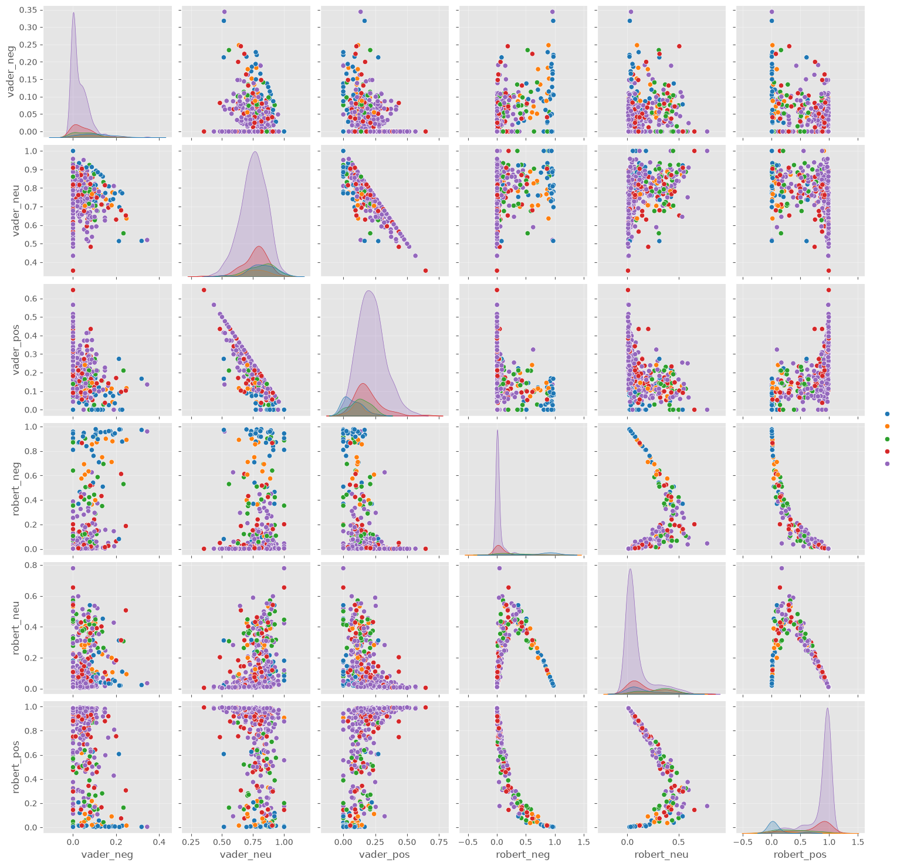

# 📊 Sentiment Analysis of Customer Reviews

A Natural Language Processing (NLP) project that analyzes customer reviews and compares sentiment predictions using **VADER** and a pretrained **RoBERTa** transformer model.

The project uses the **Amazon Fine Food Reviews dataset** to explore customer feedback, generate sentiment scores, and visualize sentiment patterns.

## 🚀 Project Overview

Customer reviews contain valuable information about customer opinions and satisfaction. This project uses NLP techniques to automatically analyze the sentiment expressed in textual reviews.

Two approaches are explored:

* **VADER** – Lexicon and rule-based sentiment analysis.
* **RoBERTa** – Transformer-based sentiment classification using a pretrained Hugging Face model.

The outputs from both approaches are analyzed and compared with the original review information.

## 🛠️ Tech Stack

* **Python**
* **Pandas & NumPy** – Data processing
* **NLTK** – Natural Language Processing
* **VADER** – Sentiment analysis
* **Hugging Face Transformers** – Transformer-based NLP
* **RoBERTa** – Sentiment classification
* **Matplotlib & Seaborn** – Data visualization
* **Jupyter Notebook** – Development and experimentation

## 📂 Dataset

The project uses the **Amazon Fine Food Reviews Dataset**, containing customer reviews and ratings.

The original dataset contains more than **500,000 reviews**. A smaller subset is used in the notebook for experimentation and faster processing.

## 📊 Model Performance

The sentiment predictions were evaluated against sentiment labels derived from the customer ratings:

- **1–2 stars → Negative**
- **3 stars → Neutral**
- **4–5 stars → Positive**

| Model | Accuracy |
|---|---:|
| VADER | **83.13%** |
| RoBERTa | **85.54%** |

### Accuracy Comparison

## 🔄 Project Workflow

```text
Amazon Customer Reviews
          ↓
Data Loading & Exploration
          ↓
NLP Processing
          ↓
   ┌──────────────┐
   │              │
   ↓              ↓
 VADER         RoBERTa
   │              │
   ↓              ↓
Sentiment      Sentiment
 Scores         Scores
   │              │
   └───────┬──────┘
           ↓
    Comparison & Analysis
           ↓
      Visualization
```

## 🔍 Key Features

* Exploratory Data Analysis of customer reviews
* Text processing using NLTK
* Sentiment analysis using VADER
* Transformer-based sentiment analysis using RoBERTa
* Comparison of sentiment scores
* Visualization of sentiment patterns
* Integration of sentiment results with review data

## 📊 Sentiment Analysis

### VADER

VADER generates:

* Positive score
* Negative score
* Neutral score
* Compound score

### RoBERTa

The project uses the pretrained model:

```text
cardiffnlp/twitter-roberta-base-sentiment
```

The model generates probability scores for different sentiment classes.



## 📁 Project Structure

```text
Sentiment-Analysis/
│
├── Sentiment.ipynb
├── comparision_plot.png
├── pyproject.toml
├── uv.lock
└── README.md
```

## ⚙️ Installation

Clone the repository:

```bash
git clone https://github.com/SureRanganath/Sentiment-Analysis.git
cd Sentiment-Analysis
```

Install the required dependencies:

```bash
pip install pandas numpy matplotlib seaborn nltk scipy torch transformers jupyter tqdm ipywidgets
```

Or, if you are using `uv`:

```bash
uv sync
```

## ▶️ Run the Project

Start Jupyter Notebook:

```bash
jupyter notebook
```

Open:

```text
Sentiment.ipynb
```

Run the notebook cells sequentially.

> **Note:** The notebook requires the `Reviews.csv` dataset to be available in the project directory.

## 🎯 Learning Outcomes

Through this project, I gained practical experience in:

* Natural Language Processing
* Sentiment Analysis
* Exploratory Data Analysis
* Text preprocessing
* Transformer-based NLP models
* Hugging Face Transformers
* Data visualization
* Python data analysis

## 🔮 Future Improvements

* Add formal model evaluation using Accuracy, Precision, Recall, and F1-score.
* Process the complete dataset efficiently.
* Implement batch processing for transformer inference.
* Build an interactive sentiment analysis dashboard.
* Develop a web application for real-time sentiment prediction.

## 📊 Visualization

The following visualization compares the sentiment analysis results:


